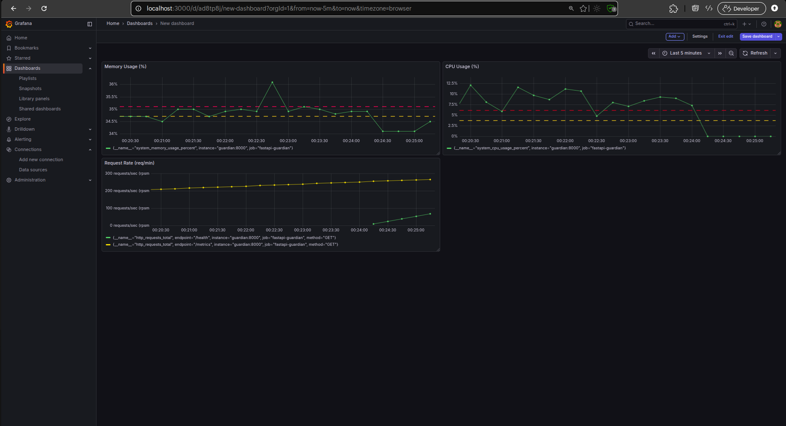

# FastAPI Service Health & Cost Guardian

FastAPI Service Health & Cost Guardian is a production-style observability service designed to demonstrate **service health monitoring, resource awareness, and alerting practices** used by SRE and DevOps teams.

The project focuses on **operability, reliability, and cost-risk detection**, rather than application features.

---

## Project Objectives

The primary goals of this project are:

- Expose meaningful service health signals
- Monitor CPU, memory, and request behavior
- Enforce container-level resource limits
- Visualize system behavior over time
- Detect reliability and cost risks using alerts
- Validate the system end-to-end using real tooling

---

## System Architecture
```
Client
|
v
FastAPI Application
├── /health
├── /metrics
|
v
Prometheus (scraping + alert rules)
|
v
Grafana (dashboards)
```


Alerts are evaluated by Prometheus and managed through Alertmanager.

---

## Technology Stack

### Backend
- FastAPI
- Python
- Prometheus Python Client
- psutil

### Observability
- Prometheus
- Grafana
- Alertmanager

### Infrastructure
- Docker
- Docker Compose
- Linux cgroups (CPU and memory limits)

---

## Application Endpoints

| Endpoint | Description |
|--------|-------------|
| `/health` | Returns service health along with CPU and memory usage |
| `/metrics` | Exposes Prometheus-compatible metrics |

---

## Metrics Exposed

The service exports the following metrics:

- `system_cpu_usage_percent`
- `system_memory_usage_percent`
- `http_requests_total`

These metrics are scraped by Prometheus and stored as time-series data.

---

## Dashboards

Grafana dashboards visualize:

- CPU usage and saturation
- Memory usage and OOM risk
- HTTP request patterns and trends

The dashboards are designed to help correlate **traffic patterns with resource usage** and detect early signs of instability.



---

## Alerting

Prometheus alert rules are defined to detect:

- Sustained high CPU usage
- High memory usage indicating OOM risk
- Abnormal request rate spikes

Alerts are configured with duration thresholds to avoid noise and alert fatigue.  
Alertmanager is used to group and manage alert lifecycles.

---

## Resource Limits and cgroups

The application runs with enforced container resource limits:

- CPU limits cause throttling under sustained load
- Memory limits trigger OOMKill behavior when exceeded

This setup demonstrates real container behavior under production constraints.

---

## Project Structure
```
.
├── app/
│ ├── main.py
│ ├── api/
│ │ ├── health.py
│ │ └── metrics.py
│ └── core/
│ ├── metrics.py
│ └── system_stats.py
├── docker-compose.yml
├── Dockerfile
├── prometheus.yml
├── alerts.yml
├── alertmanager.yml
├── .dockerignore
└── README.md
```

---

## Running the Project

### Prerequisites
- Docker
- Docker Compose

### Start the full stack

```bash
docker compose up --build
```

### Accessing Services

---

#### Servic URL

FastAPI	http://localhost:8000

Prometheus	http://localhost:9090

Grafana	http://localhost:3000

Alertmanager	http://localhost:9093

---

#### Grafana default credentials:
```
username: admin
password: admin
```

### Testing and Validation

---

The project was validated end-to-end by:

- Verifying health and metrics endpoints

- Confirming Prometheus target scraping

- Visualizing metrics in Grafana dashboards

- Triggering alerts under sustained load

- Observing CPU throttling and OOMKill behavior

- Ensuring all components run reliably via Docker Compose

---

## Key Learnings

Health checks must reflect system pressure, not just uptime

CPU saturation degrades performance; memory exhaustion causes crashes

Low-traffic services require different PromQL strategies

Dashboards are for humans, alerts are for action

Observability is about interpretation, not tooling alone

---

